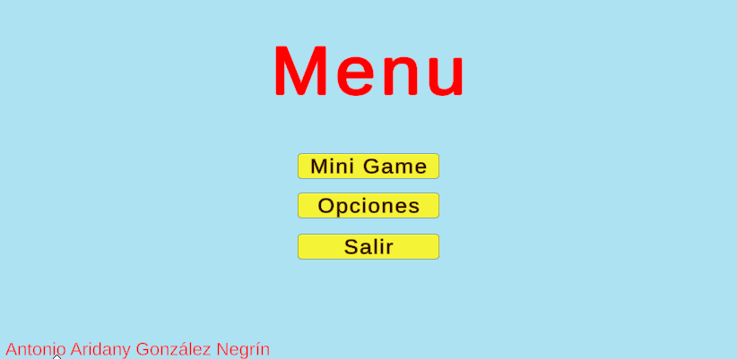
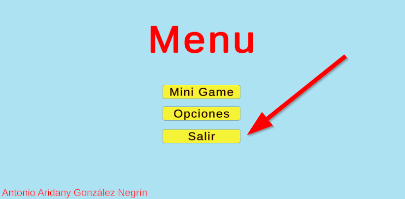
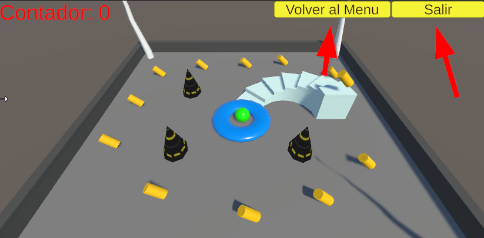

<p align="center"></p>

# Roll a Ball Tutorial

The first thing you see is a menu:
Mini Game: If we click on this button it will take us directly to the game.
Options: Clicking here, we will see the usability of the game.

> Note: We quit the game.

### Roll a Ball Tutorial
  - [Requirements](#Requirements)
  - [Part 0: Menu](#Part-0:-Menu)
  - [Part 1: Mini Game](#Part-1:-Mini-Game)
  - [Part 2: Options](#Part-2:-Opcions)
  - [Part 3: Exit](#Part-3:-Exit)
  - [Part 4: Buttons](#Part-4:-Buttons)

## Requirements

To be able to use this this project you must have Unity installed

  ```bash
  https://store.unity.com/es#plans-individual
  ```

## Part 0: Menu



The first thing we are going to find is the menu to be able to go to the following game options:

• Mini Game
• Options
• Exit

## Part 1: Mini Game


Here we have the game. The objective is to catch all the squares, once the counter is at 12 we will go to the next scene where we will have to catch all the cylinders this time with a little more difficulty, using the jumps. Once the game is over, it will show us a game end screen.

## Part 2: Options


Here the game options will be shown to be able to play it.

## Part 3: Exit



The only thing this button does is exit the game.

## Part 4: Buttons



In all the scenes you will have two buttons, one for Exit and the other for Return to the Menu.
