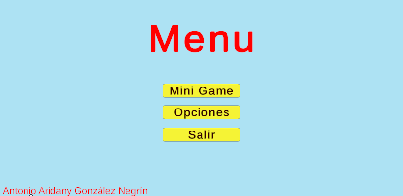
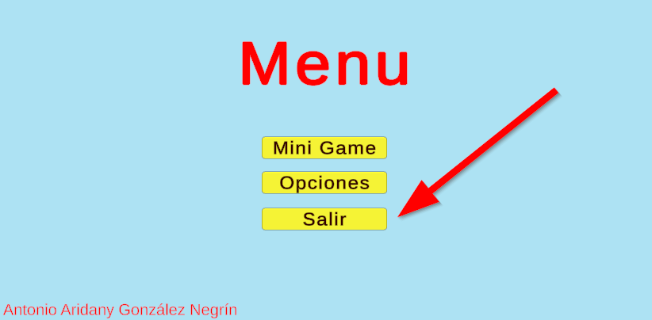
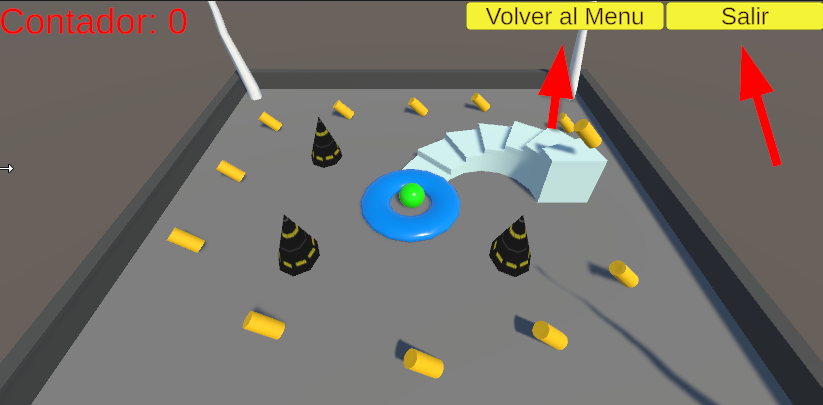

<p align="center"></p>

# Roll a Ball Tutorial

Lo primero que se ve es una menú:
Mini Game: Si hacemos clic en este botón nos llevará directamente al juego.
Opciones: Haciendo clic aquí, veremos la usabilidad del juego.
Salir: Salimos del juego.

> Nota: Proyecto de Unity

### Roll a Ball Tutorial
  - [Requisitos](#Requisitos)
  - [Parte 0: Menu](#Parte-0:-Menu)
  - [Parte 1: Mini Game](#Parte-1:-Mini-Game)
  - [Parte 2: Opciones](#Parte-2:-Opciones)
  - [Parte 3: Salir](#Parte-3:-Salir)
  - [Parte 4: Botones](#Parte-4:-Botones)

## Requisitos

Para poder utilziar este este proyecto debes tener instalado Unity
  ```bash
  https://store.unity.com/es#plans-individual
  ```

## Parte 0: Menu



Lo primero que nos vamos a encontrar es el menú para poder ir a las siguientes opciones del juego:
•	Mini Game
•	Opciones
•	Salir
## Parte 1: Mini Game


Aquí tenemos el juego. El objetivo es pillar todos los cuadrados, una vez el contador esté a 12 pasaremos a la siguiente escena que tendremos que pillar esta vez todos los cilindros con un poco más de dificultad, usando los saltos. Una vez finalizado el juego nos mostrará una pantalla de fin de juego. 

## Parte 2: Opciones


Aquí se mostrar las opciones de juego para poder jugarlo.

## Parte 3: Salir



Este botón lo unico que hace es salir del juego.

## Parte 4: Botones



En todas las escenas tendrás dos botones uno de Salir y otro de Volver al Menú.

